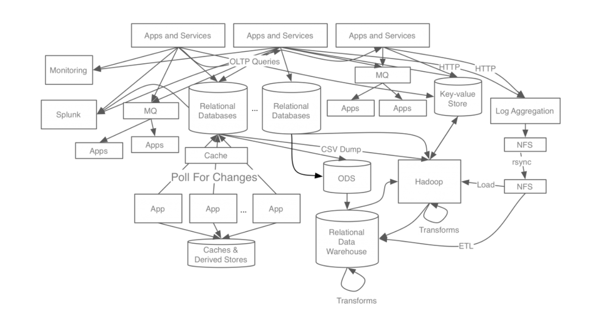
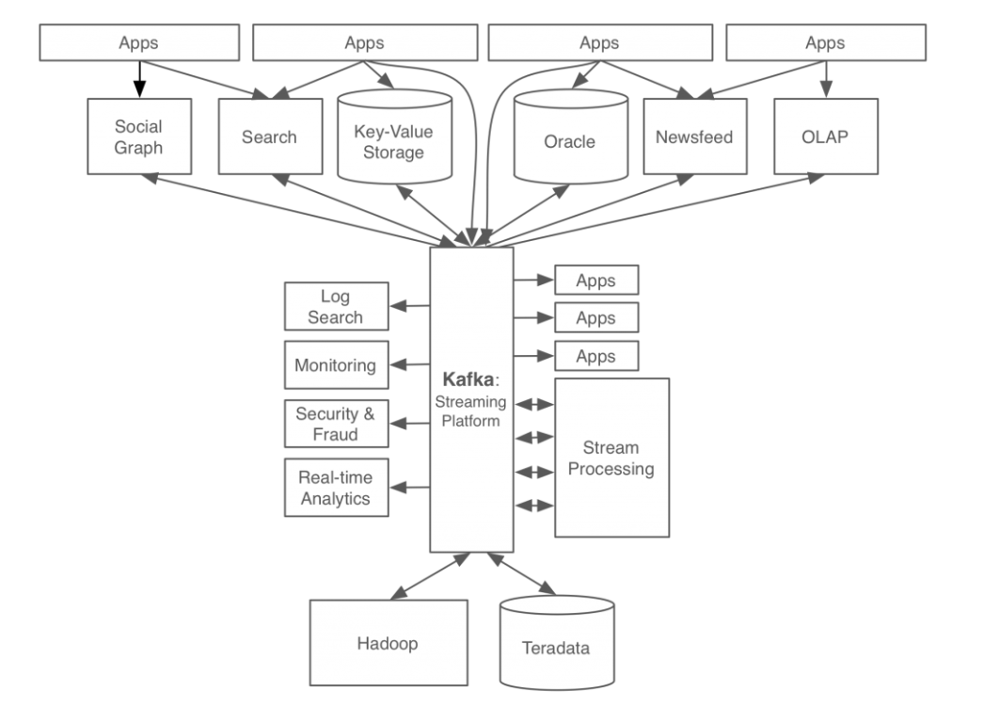
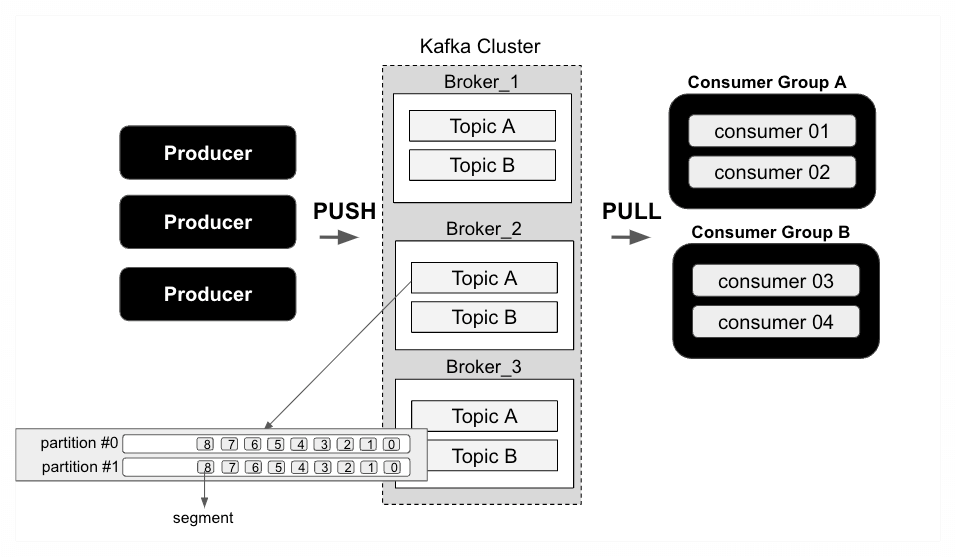

# h1 카프카(Kafka)란 무엇인가?

흔히 카프카로 불리우는 아파치 카프카는 대용량 실시간 데이터 스트리밍 플랫폼으로, 분산형 메시징 시스템입니다. 카프카는 글로벌 구인/구직 소셜 네트워크 서비스사인
Linkedin에서 기존의 레거시 프로그램 아키텍처가 가지는 앤드투앤드 연결 방식으로 인한 데이터 연동의 복잡성, 시스템 확장의 어려움 등을 극복하기 위해 개발한 오픈소스
소프트웨어입니다.

*  링크드인의 기존 앤드투앤드 방식의 데이터 파이프라인 모습
<figure>

  <figcaption>
    https://www.confluent.io/blog/event-streaming-platform-1/
  </figcaption>
</figure>

* 이벤트 스트리밍 플랫폼인 카프카를 적용한 이후의 데이터 파이프라인 모습

<figure>

  <figcaption>
    https://www.confluent.io/blog/event-streaming-platform-1/
  </figcaption>
</figure>

위의 두 데이터 파이프 라인 모습을 비교해 보면 알 수 있듯이, 기존에 각각의 어플리케이션이 직접 연결되어 복잡한 구조를 띄었던 데이터 구조가, 중앙의 범용 파이프 라인(즉 카프카)을 중심으로 데이터가 이동되면서 훨씬 간결한 모습으로 바뀌게 된 것을 확인할 수 있습니다.

시간이 갈수록 데이터의 중요성은 커져가고, 많은 기업들에서는 빅데이터를 어떻게 관리하느냐가 중요한 관심사로 떠오르면서 대규모의 데이터 스트리밍을 효율적으로 처리하는 카프카에 대한
관심과 사용량도 더욱더 증가할 것으로 보여지는 반면, 카프카란 무엇인가에 대한 이해가 부족하다고 생각하여 해당 글을 작성하였습니다.

* 빅데이터
  디지털 환경에서 생성되는 데이터로,그 규모가 방대하고, 생성 주기도 짧고, 형태도 수치 데이터 뿐 아니라 문자와 영상 데이터를 포함하는 대규모 데이터를 말한다.

본격적으로 카프카를 설명하기에 앞서 간략히 카프카에 대해 정의하면 카프카는 기본적으로 메시지(=데이터)를 받아 토픽이라 불리우는 곳에 보관, 관리하며 받은 메시지를 다른 시스템이나
장치에 전달하는 분산 스트리밍 플랫폼을 의미합니다.

## 카프카의 기본 구조

프로듀서(Producer) -> 브로커(Broker) -> 컨슈머(Consumer) 

카프카 시스템은 아래의 이미지와 같이 기본적으로 프로듀서가 메시지를 생성한 후 토픽을 지정하여 브로커에 메시지를 전달하고 해당 토픽을 구독한 컨슈머가 브로커에서 메시지를 받아오는 형태로 되어 있습니다. 브로커는 일종의 서버로서 데이터의 안정성을 위해 여러 대의 브로커로 이루어진 클러스터 형태로 구성할 수 있습니다.

<figure>

</figure>
카프카 시스템의 구성 요소와 주요 키워드는 다음과 같습니다.

### Topic

Topic은 메시지들을 구분하는 논리적 단위로서, 프로듀서와 컨슈머는 Topic에 대하여 이벤트 스트림을 구성, 저장하고 소비합니다.
Topic은 다음과 같은 특징을 지닙니다.

1) append only

토픽에 새로운 이벤트 메시지가 들어오면 기존의 메시지를 유지한 상태로 로그 끝에 새로운 이벤트 메시지가 추가되어 저장됩니다. 즉 Topic에 들어온 메시지는 신규로 작성이 되는
것만 가능하며 등록된 메시지를 수정하는 것은 불가능합니다. 이와 같은 특성으로 인하여 카프카는 데이터의 무결성과 일관성을 보장할 수 있습니다.

2) Topic은 다중 프로듀서와 컨슈머에 의해 생성되고 소비될 수 있습니다.

토픽의 메시지는 특정 컨슈머가 가져가서 소비한다고 하더라도, 토픽에서 해당 메시지가 삭제되지 않고 그대로 존재하기 때문에 다른 컨슈머가 다시 해당 메시지에 접근하고 메시지를
가져가는 것이 가능합니다.

3) 분산 데이터 저장

토픽의 데이터는 여러 브로커들에 분산 저장되어 관리됨으로써 데이터의 안정성과 가용성을 보장할 수 있도록 합니다.

* 메시지 : 카프카에서 처리되는 데이터의 최소 단위, 기본적으로 key와 value로 이루어짐

### Producer

#### 메시지를 생성하고 전달하는 주체

Producer는 메시지를 생성하고 전달하는 주체로서, Topic을 지정하여 메시지(=이벤트 스트림)를 리더 파티션이 존재하는 브로커에 전송합니다. Producer는 메시지 전송
시에 파티션 키를 지정할 수 있으며, 파티션 키를 지정하지 않은 경우 라운드 로빈 방식으로 파티션에 데이터를 적재합니다. 프로듀서는 또한 배치 크기나, 대기 시간을 기준으로 하여
데이터를 모아 일괄 처리 할 수도 있습니다.

* round-robin 방식 : 특별한 우선 순위를 두지 않고, 순환을 돌면서 자원을 할당하는 방식.

### Consumer

#### 메시지를 받아와 소비하는 주체

Consumer는 메시지를 받아와 소비하는 주체로서, Producer와 마찬가지로 Topic을 기준으로 하여 카프카에서 메시지를 받아옵니다. 카프카의 Consumer는 다른 메시징
시스템의 데이터 소비 주체들이 데이터를 push 즉 일방적으로 데이터를 받게 되는 것이 아니라, Consumer가 카프카 시스템에서 polling이라 하여 직접 구독한
Topic에서 메시지를 가져오는 요청을 통해 데이터를 전달받습니다. Consumer는 Topic에서 메시지를 받아올 때, 가장 먼저 파티션에 들어온 데이터부터 순차적으로
읽어옵니다. 이때 Consumer는 성공적으로 데이터를 처리한 메시지의 오프셋을 커밋하여 기록함으로써, 자신이 메시지를 읽은 위치를 기록합니다. 이렇게 기록된 오프셋 기록을 통해
파티션으로부터 데이터를 읽어들이던 Consumer에 문제가 발생하더라도 해당 컨슈머가 속한 컨슈머 그룹의 다른 컨슈머가 해당 역할을 이어받아, 데이터를 처리할 수 있게 됩니다.

* 컨슈머 그룹
  컨슈머들의 집합을 의미합니다. 메시지를 가져올 때 컨슈머 그룹의 각 컨슈머들은 구독한 토픽의 메시지들을 여러 파티션에서 동시에 읽어와 데이터를 처리합니다.

### Broker

#### 카프카 클러스터를 구성하는 각각의 노드(=서버)

프로듀서부터 전송된 메시지를 저장하는 서버입니다. 브로커는 프로듀서로부터 전달받은 메시지를 토픽 단위로 관리하며, 컨슈머들에게 전달하는 역할을 수행합니다. 일반적으로 흔히
이야기하는 카프카 시스템은 데이터의 안전성 가용성 등을 위해 n대의 브로커로 이루어진 클러스터 형태로 구성됩니다. (한 대의 브로커 만으로도 운영은 가능하며 이를 단일 클러스터
카프카라합니다.) 여러 대의 브로커로 이루어지는 카프카 클러스터 형태는 확장이 용이하기 때문에 시스템 트래픽 증가에 대해 유연한 대처가 가능합니다.

카프카 클러스터 내에서 각 브로커들은 고유한 ID를 부여받아 클러스터 내에서 식별되며, 각 브로커들은 서로 연결되어 데이터를 동기화하고, 마치 하나의 시스템처럼 작동합니다. n대의
브로커가 하나의 시스템처럼 작동이 가능한 것은 카프카 클러스터를 구성하는 n개의 브로커 중 1대의 브로커가 컨트롤러가 되어 브로커들을 관리하기 때문입니다. 컨트롤러 브로커는
브로커들의 작동 상태를 모니터링하며, 리더 파티션을 포함하는 브로커에 문제가 발생한 경우 해당 브로커를 카프카 클러스터에서 제외시키고, 다른 브로커에 토픽의 리더 파티션을
재분배하는 등의 역할을 수행합니다.

### Partition

#### 토픽의 구성 단위

파티션은 논리적 개념인 토픽을 구성하는 단위로, 프로듀서가 전송한 메시지(=레코드)를 실제 저장하는 단위입니다. 각 파티션은 메시지 스트림을 순차적으로 저장하며 여러 브로커들
사이에 분산 저장됩니다.
파티션은 리더 파티션과 팔로워 파티션으로 구분되며. 여러 브로커에 분산되어 존재합니다.리더 파티션은 프로듀서, 컨슈머와 직접 연결하여 메시지를 주고받고 실질적으로
Read/Write가 가능한 파티션이며, 팔로워 파티션은 리더 파티션에 저장된 데이터를 동기화하여 데이터의 안정성을 보장하여 주는 파티션입니다. 여러 파티션 중 리더 파티션은 오직
하나만 가능하고, 팔로워 파티션은 여러 개를 둘 수 있으며, replication.factor로 설정합니다. 예를 들어 replication.factor가 1인 경우 리더 파티션만
존재하고 팔로워 파티션은 두지 않는 것이며, replication.factor가 2인 경우에는 하나의 리더 파티션과 하나의 팔로워 파티션으로 구성되도록 설정하는 것 입니다. 카프카
시스템 설계자는 데이터의 안정성을 위해 원본 데이터를 복제해두는 파티션의 개수를 적절히 조절할 수 있습니다.

* 토픽은 여러 개의 파티션으로 나뉘어지며, 파티션은 여러 개의 세그먼트로 나뉩니다.

### Offset

카프카에서 Offset은 토픽 내의 파티션에 저장된 메시지들을 구분하는 고유한 식별값으로, 파티션 내의 메시지 위치를 나타냅니다. 메시지가 들어오면 순차적으로 증가하는 값(
=오프셋)을 부여하여 동일 파티션에 한하여 메시지의 순서를 보장합니다.

## 카프카의 특징

1. 영속성
    + 카프카 이전의 메시징 시스템이 메모리에 데이터를 저장하였기 때문에, 컨슈머가 메시지를 가져가기 전에 서버가 다운되거나, 메시지를 한 번 가져가면 메시지가 사라져서 해당
      메시지에 다시 접근할 수 없었습니다. 반면 카프카의 경우 데이터를 디스크에 저장하기 때문에 서버에 문제가 생기거나, 하나의 컨슈머가 메시지를 가져가도, 디스크에 데이터가
      계속
      남아 있기 때문에 데이터 손실 위험이 적고 다른 컨슈머가 다시 해당 메시지에 접근하여 메시지를 가져오는 것이 가능합니다.

* 카프카의 데이터는 카프카 토픽별로 설정에 따라서 데이터의 보관 기간을 정의합니다.

2. 분산 시스템
    + 카프카 시스템은 앞서 이야기 했던 것과 같이 여러 대의 브로커로 구성된 클러스터 구조로 되어 있어 데이터를 복제하여 저장함으로써 데이터의 안정성을 보장하고, 분산
      처리함으로써 시스템 성능을 향상시킵니다. 또한 시스템 트래픽 증가시에도 브로커를 추가함으로써 시스템의 유연한 확장이 가능하고, 대규모 데이터 처리에 유리합니다.

3. 유연성
    + 카프카의 데이터 전송 단위인 메시지는 바이트 배열로 표현되는 단순한 형태의 메시지 형태를 갖추고 있어, 다양한 타입을 지원할 수 있어 유연한 데이터 처리가 가능합니다.
      데이터 타입에 대한 유연성 덕분에 카프카는 다양한 애플리케이션 또는 시스템과의 통합에 있어 유연하게 적용이 가능합니다.

4. 다중 프로듀서와 다중 컨슈머
    * 카프카는 브로커를 매개체로 하여 프로듀서와 컨슈머가 메시지를 생성하여 데이터를 전송하고 소비합니다. 프로듀서와 컨슈머의 구조 특성상 처리 해야할 데이터의 양이 증가할
      경우 프로듀서와 컨슈머의 수를 추가하여 데이터 처리 속도를 높일 수 도 있습니다.

5. 신뢰성
    * 카프카는 producer acks 옵션을 통해 메시지 전달을 보장할 수 있습니다. acks 옵션에 따라 메시지가 안정적으로 저장되지 않은 경우 메시지를 재전송하도록 하여
      메시지 전달을 보장합니다.

> Producer acks 

> ack란 프로듀서가 브로커에 메시지를 전송할 때 메시지가 어디까지 안정적으로 저장되었는지를 확인할 수 있도록 설정하는 옵션입니다.
> 1. ack = 0

     프로듀서가 브로커에 연결하여 메시지 전송이 이루어지면, 파티션에 데이터가 저장되었는지와 상관없이 성공으로 간주합니다. 아무런 검증을 하지 않기 때문에
     처리 속도가 가장 빠르지만 데이터 유실 가능성이 존재합니다. 때문에 데이터의 안전성보다는, 전송 속도가 더욱 중요시되는 데이터의 처리를 위해 사용됩니다.

> 2. ack = 1

     프로듀서가 브로커에 메시지를 전송한 후, 해당 데이터가 리더 파티션에 무사히 저장된 경우 프로듀서에게 응답을 보냅니다. 일반적으로 데이터 유실 가능성이 적지만 리더
     파티션에 데이터가 저장된 후 팔로워 파티션에 데이터가 저장되기 이전에 문제가 발생하는 경우 데이터 유실 가능성이 존재합니다.
     ex) 프로듀서가 리더 파티션에 메시지를 전송 -> 리더 파티션에 메시지를 저장 -> 리더는 프로듀서에게 acks를 전달 -> 이후 팔로워 파티션들이 리더 파티션을
     주기적으로 체크하며 변경된 데이터를 동기화 하기 전에 리더 파티션에 장애 발생 -> 리더 파티션의 데이터 유실 및 팔로워 파티션들의 경우 데이터 동기화 실패 ->
     최종적으로 데이터 유실
> 3. ack = -1

     프로듀서가 브로커에 메시지를 전송하고, 리더 파티션은 물론 팔로워 파티션에도 데이터가 성공적으로 저장된 경우 프로듀서에게 응답을 보냅니다. 때문에 처리 속도는 가장
     느리지만 데이터 유실 가능성은 사실상 존재하지 않습니다.

6) 실시간 데이터 스트리밍
    * 카프카는 실시간 데이터 스트리밍을 지원합니다.

7) Pub/Sub 모델
    * 카프카는 프로듀서가 특정 토픽에 메시지를 발행하면, 해당 토픽을 구독한 컨슈머가 메시지를 받는 Pub/Sub 모델을 취하고 있습니다. Pub/Sub 모델은 카프카
      클러스터라는 중간 매개체를 통해 데이터를 주고 받기 때문에 프로듀서와 컨슈머가 서로 알 필요가 없습니다. 또한 메시지 구독이라는 형태로 컨슈머가 카프카 클러스터에서 직접
      데이터를 가져가기 때문에 프로듀서 입장에서는 컨슈머까지의 메시지 전송 성공 여부에 대해 고려하지 않아도 됩니다.

위와 같은 카프카의 특성으로 인하여 카프카는 데이터 처리를 위해 다양한 방면에서 사용됩니다.

## 카프카 사용 사례

- 증권 거래소, 은행, 보험 등에서 실시간으로 결제 및 금용 거래를 처리
- 물류 및 자동차 산업과 같은 자동차, 트럭, 함대 및 선적을 실시간 추적 및 모니터링
- 공장 및 풍력 단지와 같은 IoT 장치 또는 기타 장비에서 센서 데이터를 지속적으로 캡처하고 분석
- 소매, 호텔 및 여행 산업, 모바일 애플리케이션과 같은 고객 상호 작용 및 주문 즉시 수집
- 데이터 플랫폼, 이벤트 기반 아키텍처 및 마이크로서비스의 기반 역할

#### 출처

https://jangseongwoo.github.io/kafka/kafka_official_documents/

https://kafka.apache.org/

https://docs.confluent.io/kafka/index.html

https://www.youtube.com/playlist?list=PL3Re5Ri5rZmkY46j6WcJXQYRlDRZSUQ1j 

